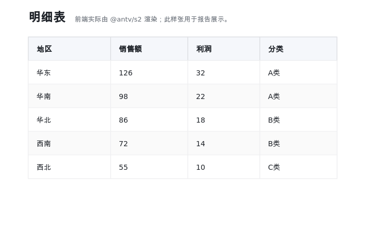
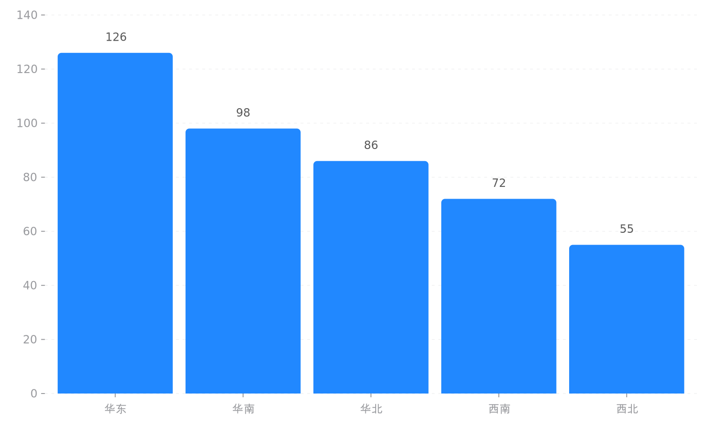
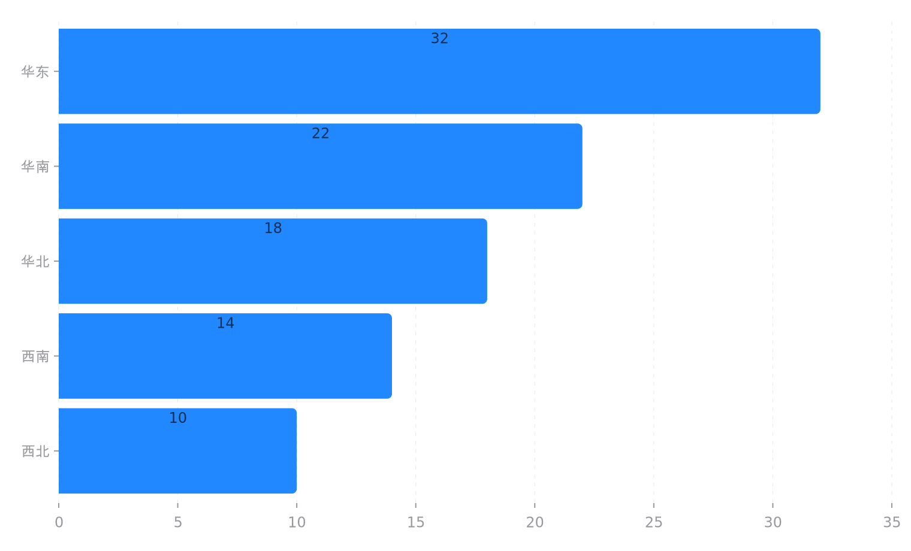
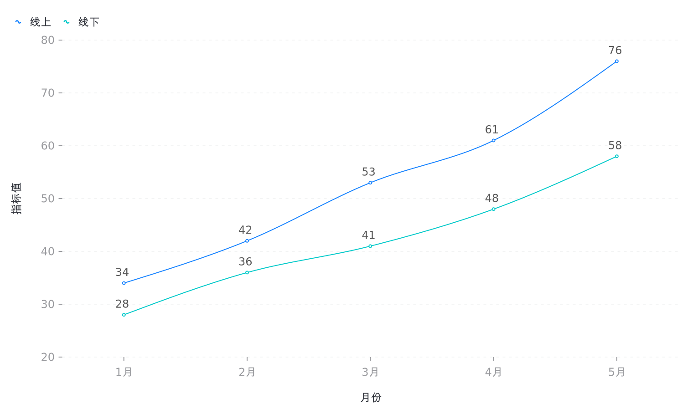
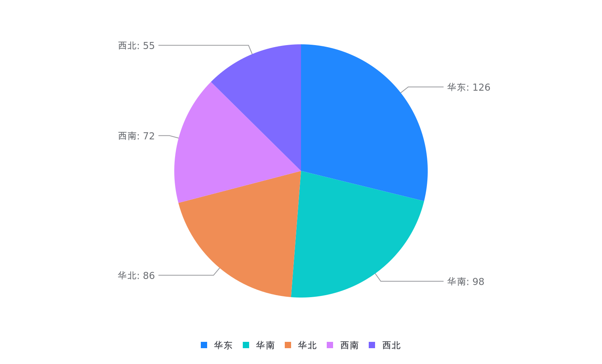
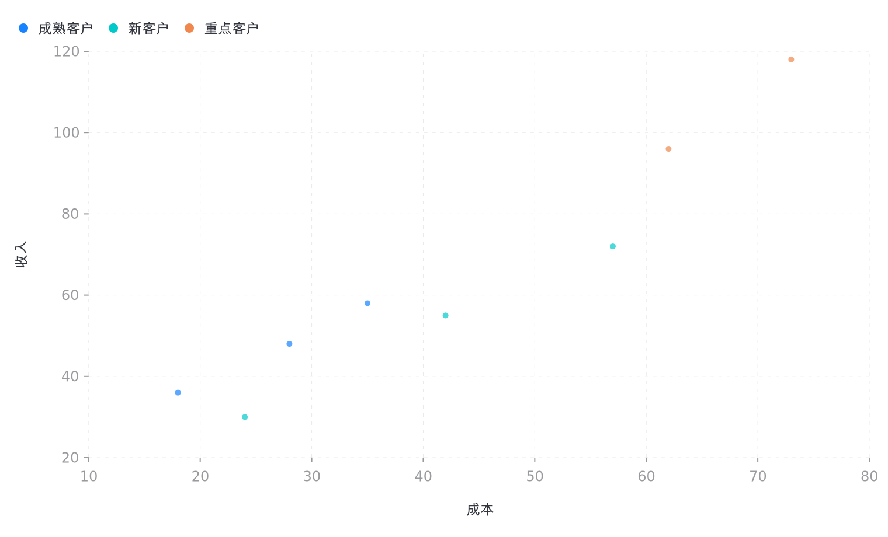
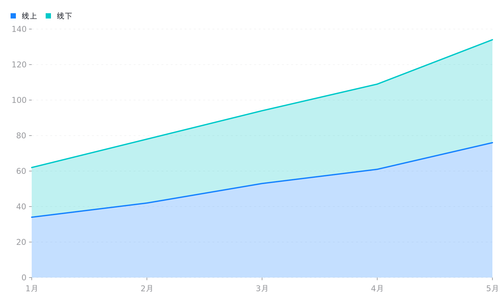

# 图表渲染检查报告

检查时间：2026-06-22

结论：当前支持的 7 类图表均可进入渲染链路。G2 图表已使用项目的 `g2-ssr/charts/*` 配置生成 PNG 样张；明细表使用前端 `@antv/s2` 渲染，已通过源码链路和前端构建检查，并生成报告展示样张。

## 总览

| 图表 | 类型 | 状态 | 说明 |
| --- | --- | --- | --- |
| 明细表 | `table` | 通过 | 前端 Table 使用 `@antv/s2`，源码链路和构建已通过；生成展示 PNG 29102 bytes |
| 柱状图 | `column` | 通过 | 生成 PNG 31579 bytes |
| 条形图 | `bar` | 通过 | 生成 PNG 32047 bytes |
| 折线图 | `line` | 通过 | 生成 PNG 61740 bytes |
| 饼图 | `pie` | 通过 | 生成 PNG 49169 bytes |
| 散点图 | `scatter` | 通过 | 生成 PNG 41193 bytes |
| 面积图 | `area` | 通过 | 生成 PNG 44078 bytes |

## 样张

### 明细表 `table`

### 柱状图 `column`

### 条形图 `bar`

### 折线图 `line`

### 饼图 `pie`

### 散点图 `scatter`

### 面积图 `area`

## 本次同步修复

- 补齐服务端 `g2-ssr` 的数值清洗逻辑，和前端保持一致，支持数字字符串、千分位字符串、百分比字符串。
- 修复服务端散点图对 X/Y 数值字段的清洗，避免数字字符串被当作分类轴。
- 保留可重复执行的样张生成脚本：`scripts/generate_chart_samples.js`。

## 备注

尝试使用本机 Chrome headless 对前端校验页全页截图时，当前环境触发 Chrome 自身截图崩溃或 DevTools 截图超时。因此本报告的图片样张使用项目容器内的 G2 SSR 渲染链路生成；前端构建已通过，`ChartComponent` 渲染注册链路已覆盖 `table/column/bar/line/pie/scatter/area`。
